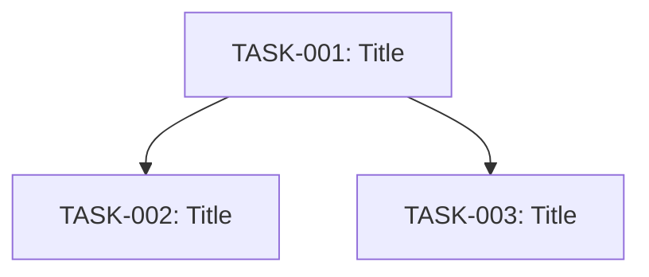

# Task Board Skill

Defines the canonical task board format and all operations that modify or read it. Decomposer invokes this to create boards, scribe invokes it to update task state, and resume invokes it to read current state.

## Canonical Format

All task boards follow this structure at `workspaces/{workspace-name}/task-boards/{feature-name}.md`:

```markdown
# Task Board: {Feature Name}
## Status: Phase {N} - {Phase Name}
## Tech Design: {link to tech-design.md or tech-design/index.md}

### Dependency Graph


### Backlog

#### TASK-001: Short title
- **Repo:** path/to/repo
- **Deps:** none
- **Priority:** P0
- **AC:**
  - [ ] First acceptance criterion
  - [ ] Second acceptance criterion

### In Progress

#### TASK-002: Short title
- **Repo:** path/to/repo
- **Deps:** TASK-001
- **Priority:** P1
- **AC:**
  - [ ] First acceptance criterion
  - [x] Second acceptance criterion (partially done)

### Blocked

#### TASK-003: Short title
- **Repo:** path/to/repo
- **Deps:** TASK-002
- **Priority:** P1
- **Blocker:** Description of what is blocking this task
- **AC:**
  - [ ] First acceptance criterion

### Done

#### TASK-004: Short title
- **Repo:** path/to/repo
- **Deps:** none
- **Priority:** P0
- **AC:**
  - [x] First acceptance criterion
  - [x] Second acceptance criterion
```

## Operations

### Create

Invoked by decomposer after task breakdown. Produces the full board from scratch.

1. Write the header: `# Task Board: {Feature Name}`
2. Write `## Status: Phase 4 - Task Breakdown (ready for implementation)`
3. Write `## Tech Design:` with link to the tech design entry document
4. Write `### Dependency Graph` with a mermaid `graph TD` showing task dependencies
5. Write all tasks under `### Backlog` using the `####` task format above
6. Write empty `### In Progress`, `### Blocked`, and `### Done` sections

Every task must include: `**Repo:**`, `**Deps:**`, `**Priority:**`, and `**AC:**` with checkbox items.

### Move Task

Invoked by scribe to move a task between sections.

1. Read the board file
2. Find the `#### TASK-XXX:` block (from the `####` header to the next `####` header or `###` section header)
3. Remove the block from its current section
4. Insert the block under the target section (`### In Progress`, `### Blocked`, or `### Done`)
5. If moving to Blocked, add a `- **Blocker:** {reason}` line after `**Priority:**`
6. If moving to Done, toggle all AC checkboxes to `[x]`
7. Preserve all other content exactly as-is (dependency graph, other tasks, tech design link)

### Mark Done

Invoked by scribe when a task is completed.

1. Move the task block to `### Done`
2. Toggle all `- [ ]` checkboxes under `**AC:**` to `- [x]`
3. Update `## Status:` phase if all tasks are now in Done

### Mark Blocked

Invoked by scribe when a task hits a blocker.

1. Move the task block to `### Blocked`
2. Add `- **Blocker:** {reason}` after `**Priority:**` (or update existing blocker)

### Start Task

Invoked by scribe when a task begins implementation.

1. Move the task block to `### In Progress`
2. Remove `**Blocker:**` line if present (unblocked)

### Read State

Invoked by resume to get current board state. Parse and return:

- Total tasks and counts per section (Backlog/In Progress/Blocked/Done)
- Currently in-progress task(s) with their descriptions
- Blocked task(s) with their blocker reasons
- The suggested next unblocked task from Backlog (highest priority, all deps in Done)

## Guidelines

- Never reorder tasks within a section — preserve insertion order
- Never modify task content (title, repo, deps, priority, AC text) during move operations
- Only toggle AC checkboxes when marking done — individual AC completion during implementation is the implementer's responsibility via direct file edit
- Preserve the mermaid dependency graph unchanged during all update operations
- If the board file does not exist, report an error — do not create it (creation is the decomposer's job via the Create operation)
