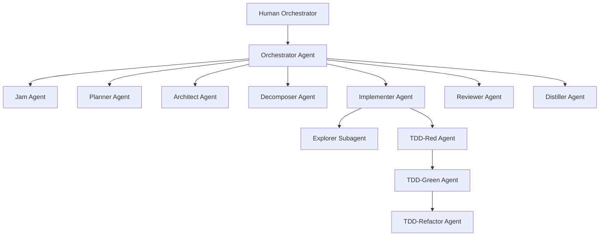

# Helix — Multi-Agent Development System

## Purpose
Helix is a VS Code plugin that provides AI agents, skills, prompts, hooks, and memory to drive the full development lifecycle — from intent to production — across multiple repos.

## System Architecture



## Workflow Phases
1. **JAM** — Refine raw feature idea into clear intent
2. **PRD** — Deep plan producing a product requirements doc
3. **TECH DESIGN** — Pseudo code, mermaid diagrams, interface contracts
4. **TASK BREAKDOWN** — Small, independent tasks with clear AC
5. **IMPLEMENTATION** — TDD loop (interactive handoff or autonomous fleet)
6. **REVIEW** — Multi-lens code review (security, correctness, domain, style)
7. **DISTILL** — Extract learnings into memory

## Key Conventions
- Agent files use `.agent.md` extension (VS Code spec)
- Skills use `directory/SKILL.md` pattern
- Prompts use `.prompt.md` extension
- Instructions use `.instructions.md` with `applyTo` frontmatter
- XML in prompts uses flat nested tags, NO attributes
- Subagent context passing is prompt-based by default, file fallback for large context
- Memory is 3-tier: short-term (session), episodic (summaries), long-term (learnings)
- Error handling: escalate to human, never auto-rollback

## Directory Structure
```
helix/
├── plugin.json              # VS Code plugin metadata
├── AGENTS.md                # this file
├── agents/                  # custom agent definitions (.agent.md)
├── skills/                  # reusable skills (directory/SKILL.md)
├── hooks/                   # lifecycle hooks (hooks.json)
├── .mcp.json                # MCP servers (Playwright etc)
├── templates/               # templates + examples for maker agent
├── scripts/                 # setup and hook scripts
├── workspaces/              # VSCode workspace files per subsystem
├── memory/                  # global episodic + long-term memory
├── task-boards/             # kanban per feature
└── decisions/               # decision log per feature
```
