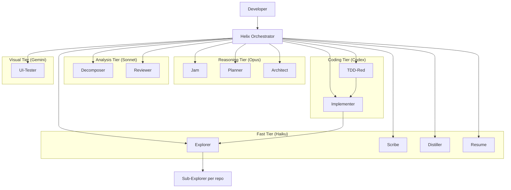

# Helix — Multi-Agent Development System

## Purpose

Helix is a meta-repo that coordinates AI-driven development across multiple service repos. It provides agents, skills, prompts, hooks, and memory to drive the full lifecycle — from intent to production.

Helix is **tech-agnostic** — it discovers each repo's stack, conventions, and patterns via the `onboard` skill. Agents never assume a specific language, framework, or cloud provider.

## System Architecture



## Lifecycle Overview

Helix is not a single prompt that writes code. It is a staged delivery system with explicit loops inside each phase and a scheduler loop around implementation.

```text
SETUP            ALIGN           SPECIFY         DESIGN            BREAK DOWN          EXECUTE               REVIEW            LEARN
┌─────────────┐  ┌────────────┐  ┌────────────┐  ┌──────────────┐  ┌───────────────┐  ┌─────────────────┐  ┌──────────────┐  ┌───────────┐
│ Workspace   │  │ JAM        │  │ PRD        │  │ Tech Design  │  │ Tasks +       │  │ TDD + Scheduler │  │ Multi-lens   │  │ Distill   │
│ Sync        │→ │ Refine     │→ │ Plan       │→ │              │→ │ Exec Plan     │→ │ Ralph / Fleet   │→ │ QA Gate      │→ │ Memory    │
│ + Onboard   │  │ Intent     │  │            │  │              │  │               │  │                 │  │              │  │           │
└─────────────┘  └────────────┘  └────────────┘  └──────────────┘  └───────────────┘  └─────────────────┘  └──────────────┘  └───────────┘

Phase loops:
  SETUP         ↺ sync / onboard / verify workspace
  JAM           ↺ clarify / inspect code / tighten scope
  PRD           ↺ gather evidence / resolve gaps / revise
  TECH DESIGN   ↺ inspect patterns / lock contracts / revise
  BREAK DOWN    ↺ split tasks / add ownership + commands / check autonomy gates

Implementation loops:
  Task-level TDD  RED -> GREEN -> REFACTOR -> FULL SUITE
  Ralph loop      pick next safe task -> execute -> record result -> repeat
  Fleet loop      select disjoint tasks -> run parallel wave -> collect results -> schedule next wave
  Review loop     security -> correctness -> domain logic -> coding style -> test coverage -> fix blockers -> re-review
```

## Workflow Phases

0. **SETUP** — Create or activate a workspace, sync repos, and onboard each repo so Helix discovers conventions instead of guessing them
1. **JAM** — Refine a raw feature idea into clear intent with probing questions and codebase context
2. **PRD** — Produce a product requirements doc with concrete, testable acceptance criteria
3. **TECH DESIGN** — Lock pseudo code, diagrams, contracts, boundaries, and rollout constraints
4. **TASK BREAKDOWN** — Split the design into small repo-scoped tasks plus machine-readable execution contracts
5. **IMPLEMENTATION** — Execute tasks through TDD, either interactively or via Ralph loop / fleet scheduling
6. **REVIEW** — Run multi-lens quality gates across security, correctness, domain logic, style, and tests
7. **DISTILL** — Extract episodic memory, reusable learnings, and candidate skills

## Phase Loops

| Phase | Primary loop | Exit artifact |
|------|--------------|---------------|
| **Setup** | attach or clone repos → onboard or refresh repo context → verify active workspace → repeat per repo | `workspace.yaml`, repo `AGENTS.md`, `.instructions.md`, active workspace pointer |
| **JAM** | restate intent → ask one clarifying question → inspect code if needed → tighten scope → repeat until the feature is unambiguous | `refined-intent.md` |
| **PRD** | gather domain evidence → draft requirements → surface gaps or conflicts → revise with user → repeat until requirements are testable | `prd.md` |
| **Tech Design** | inspect existing patterns → define contracts and boundaries → review with user → revise until interfaces and ownership are locked | `tech-design.md` |
| **Task Breakdown** | split work into repo-scoped tasks → add dependencies, commands, write ownership, and `done_when` → check autonomy gates → resize or repair → repeat until the plan is runnable | task board + execution plan |
| **Implementation** | run task-level TDD loop, then scheduler loop to pick the next task or fleet wave | commits in service repos + task state updates |
| **Review** | run review lenses independently → report blockers → fix or escalate → re-review until pass or stop | review verdict |
| **Distill** | summarize what happened → capture reusable learnings → nominate candidate skills → update memory index | episodic memory + learnings |

## Core Execution Loops

### Task-Level TDD Loop

`RED → GREEN → REFACTOR → FULL SUITE`

- **RED** — write failing tests from acceptance criteria
- **GREEN** — write the minimum implementation to pass
- **REFACTOR** — improve only within task scope while staying green
- **FULL SUITE** — run repo-level verification before marking the task done

### Ralph Loop

`pick highest-priority unblocked task → execute → record result → recompute next task → repeat`

- Default autonomous mode
- Uses execution plan ownership, commands, and `done_when` as the control contract
- Stops on blockers and escalates instead of guessing or rolling back

### Fleet Loop

`select disjoint tasks → spawn parallel implementers → collect results → update state → schedule next wave`

- Used only when write ownership is disjoint and shared contracts are already locked
- Parallelism is a scheduling decision, not a shortcut around design or task safety

### Review Loop

`security → correctness → domain logic → coding style → test coverage`

- Each lens runs independently
- Blocking findings send work back to implementation before merge or PR creation

## Optional Copilot Rubber Duck Checkpoints

When Helix is running inside GitHub Copilot CLI experimental mode, it can use Rubber Duck as an optional cross-family second opinion. In the current Copilot rollout, this typically means a Claude-family orchestrator is selected and GPT-5.4 access is enabled. This is a host-runtime capability, not a Helix runtime dependency.

- Best checkpoints: after PRD, after tech design, after task breakdown, after complex implementation, after writing tests, and when an agent is stuck
- Best fit: complex refactors, cross-repo contract changes, high-stakes tasks, and execution plans that are about to enter Ralph loop or fleet mode
- Treat the critique as advisory only; if it changes scope, design, or task safety, route back to the correct phase and record the decision
- If Rubber Duck is unavailable, Helix continues its normal lifecycle without blocking

## Execution Modes

| Mode | Mechanism | Use Case |
|------|-----------|----------|
| **Interactive** | Handoffs (user clicks to advance) | Maximum control, phase-by-phase |
| **Fast-track** | Auto-chain into Ralph loop | Trusted changes, minimal supervision |
| **Ralph loop** | Highest-priority unblocked task, commit, repeat | Default autonomous delivery |
| **Fleet** | Parallel `runSubagent` spawns | Multi-task implementation |

## Agent Roster (13 agents)

| Agent | Model Tier | Purpose | User-invocable? |
|-------|-----------|---------|-----------------|
| helix | Sonnet (analysis) | Pure dispatcher — routes, detects mode | Yes |
| scribe | Haiku (fast) | Background state — task boards, decisions | No |
| jam | Opus (reasoning) | Intent refinement through dialogue | Yes |
| planner | Opus (reasoning) | PRD from refined intent | Yes |
| architect | Opus (reasoning) | Technical design with diagrams/contracts | Yes |
| decomposer | Sonnet (analysis) | Break design into repo-scoped tasks | Yes |
| explorer | Haiku (fast) | Multi-repo context gathering, file bundles | No |
| implementer | Codex (coding) | Fleet: full TDD. Interactive: green+refactor | No |
| tdd-red | Codex (coding) | Write failing tests (interactive entry) | No |
| reviewer | Sonnet (analysis) | Multi-lens code review | Yes |
| distiller | Haiku (fast) | Extract learnings into memory | Yes |
| resume | Haiku (fast) | Status briefing for session recovery | Yes |
| ui-tester | Gemini (visual) | Playwright browser tests | Yes |

## Skills (7 skills)

| Skill | Purpose |
|-------|---------|
| onboard | Make a repo agent-ready (AGENTS.md + .instructions.md) |
| distill | Extract session learnings into memory |
| tdd-cycle | Run full red-green-refactor cycle |
| workspace-sync | Clone repos, onboard, generate VS Code workspace |
| skill-synth | Scan codebase for patterns, produce skill candidates |
| maker | Create new agents, skills, prompts, workspaces |
| refactor | Apply cross-cutting patterns from memory |

## Workspace Model

Helix coordinates work across multiple repos using **workspaces**:

```
workspaces/{name}/
├── workspace.yaml       # Repo list, URLs, roles, onboarded status
├── task-boards/         # Kanban per feature
├── execution-plans/     # Machine-readable task contracts per feature
├── decisions/           # Decision log per feature
├── refined-intent.md    # Output of JAM phase
├── prd.md               # Output of PRD phase
├── tech-design.md       # Output of TECH DESIGN phase
└── context-bundle-*.md  # Explorer output with domain, code, test, infra evidence
```

Each workspace points to sibling repos via `workspace.yaml`. Code commits go to individual repos. Workspace artifacts stay in Helix.

## Key Conventions

- Agent files: `.github/agents/{name}.agent.md` (VS Code standard location)
- Skills: `.github/skills/{name}/SKILL.md`
- Prompts: `.github/prompts/{name}.prompt.md`
- Instructions: `.github/instructions/{name}.instructions.md` (generated per-repo by onboard)
- Memory: `.helix/memory/` (episodes + learnings, cross-workspace)
- Active workspace: `.helix/active-workspace.yaml`
- Model config: `.helix/model-config.yaml`
- Hooks: `hooks/hooks.json` + `scripts/hooks/*.js`
- Context passing: file-based bundles (explorer writes to disk, implementer reads)
- Execution contracts: `execution-plans/{feature}.yaml` drives Ralph loop and fleet scheduling
- Error handling: escalate to human, never auto-rollback

## Context Economy

- Use YAML for execution contracts and compact markdown for context bundles
- Prefer `path + symbol + anchor_text` anchors over raw file paths alone
- Keep persistent instructions narrow, non-obvious, and scoped
- Omit empty sections and generic best-practice filler
- Move large evidence or inventories into annex files instead of inflating the main artifact

## Directory Structure

```
helix/                              # META-REPO (its own git repo)
├── .github/
│   ├── agents/                     # 13 agent definitions
│   ├── skills/                     # 8 universal skills
│   ├── prompts/                    # Structured output templates
│   └── copilot-instructions.md     # Workflow conventions (no stack refs)
├── .helix/
│   ├── active-workspace.yaml       # Current workspace pointer
│   ├── model-config.yaml           # Model tier assignments
│   └── memory/                     # Global memory (cross-workspace)
│       ├── index.md
│       ├── episodes/               # Session summaries
│       └── learnings/              # Reusable insights
├── workspaces/                     # Per-feature/project scope
│   └── {name}/
│       ├── workspace.yaml          # Repo list + config
│       ├── execution-plans/
│       ├── task-boards/
│       └── decisions/
├── hooks/hooks.json                # Lifecycle hook config
├── scripts/                        # Hook scripts + workspace setup
├── templates/                      # Instruction + skill templates
├── .claude/settings.json           # additionalDirectories for sibling repos
├── .mcp.json                       # MCP servers (Playwright)
└── AGENTS.md                       # This file
```
