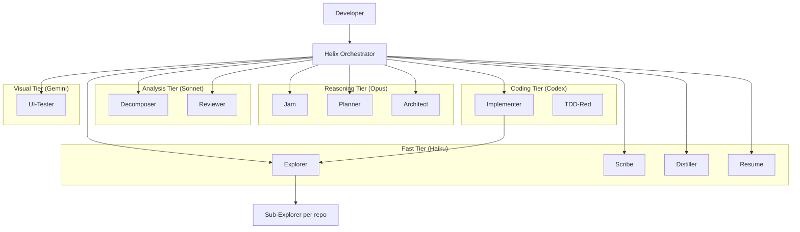

# Helix — Multi-Agent Development System

## Purpose

Helix is a meta-repo that coordinates AI-driven development across multiple service repos. It provides agents, skills, prompts, hooks, and memory to drive the full lifecycle — from intent to production.

Helix is **tech-agnostic** — it discovers each repo's stack, conventions, and patterns via the `onboard` skill. Agents never assume a specific language, framework, or cloud provider.

## System Architecture



## Workflow Phases

1. **JAM** — Refine raw feature idea into clear intent with probing questions
2. **PRD** — Deep plan producing a product requirements doc
3. **TECH DESIGN** — Pseudo code, mermaid diagrams, interface contracts
4. **TASK BREAKDOWN** — Small, independent tasks with `repo:` field and clear AC
5. **IMPLEMENTATION** — TDD loop (interactive handoffs, Ralph loop, or autonomous fleet)
6. **REVIEW** — Multi-lens code review (security, correctness, domain, style, tests)
7. **DISTILL** — Extract learnings into memory

## Execution Modes

| Mode | Mechanism | Use Case |
|------|-----------|----------|
| **Interactive** | Handoffs (user clicks to advance) | Maximum control, phase-by-phase |
| **Fast-track** | Auto-chain into Ralph loop | Trusted changes, minimal supervision |
| **Ralph loop** | Highest-priority unblocked task, commit, repeat | Default autonomous delivery |
| **Fleet** | Parallel `runSubagent` spawns | Multi-task implementation |

## Agent Roster (13 agents)

| Agent | Model Tier | Purpose | User-invocable? |
|-------|-----------|---------|-----------------|
| helix | Sonnet (analysis) | Pure dispatcher — routes, detects mode | Yes |
| scribe | Haiku (fast) | Background state — task boards, decisions | No |
| jam | Opus (reasoning) | Intent refinement through dialogue | Yes |
| planner | Opus (reasoning) | PRD from refined intent | Yes |
| architect | Opus (reasoning) | Technical design with diagrams/contracts | Yes |
| decomposer | Sonnet (analysis) | Break design into repo-scoped tasks | Yes |
| explorer | Haiku (fast) | Multi-repo context gathering, file bundles | No |
| implementer | Codex (coding) | Fleet: full TDD. Interactive: green+refactor | No |
| tdd-red | Codex (coding) | Write failing tests (interactive entry) | No |
| reviewer | Sonnet (analysis) | Multi-lens code review | Yes |
| distiller | Haiku (fast) | Extract learnings into memory | Yes |
| resume | Haiku (fast) | Status briefing for session recovery | Yes |
| ui-tester | Gemini (visual) | Playwright browser tests | Yes |

## Skills (8 skills)

| Skill | Purpose |
|-------|---------|
| onboard | Make a repo agent-ready (AGENTS.md + .instructions.md) |
| distill | Extract session learnings into memory |
| tdd-cycle | Run full red-green-refactor cycle |
| workspace-sync | Clone repos, onboard, generate VS Code workspace |
| skill-synth | Scan codebase for patterns, produce skill candidates |
| maker | Create new agents, skills, prompts, workspaces |
| refactor | Apply cross-cutting patterns from memory |

## Workspace Model

Helix coordinates work across multiple repos using **workspaces**:

```
workspaces/{name}/
├── workspace.yaml       # Repo list, URLs, roles, onboarded status
├── task-boards/         # Kanban per feature
├── execution-plans/     # Machine-readable task contracts per feature
├── decisions/           # Decision log per feature
├── refined-intent.md    # Output of JAM phase
├── prd.md               # Output of PRD phase
├── tech-design.md       # Output of TECH DESIGN phase
└── context-bundle-*.md  # Explorer output with domain, code, test, infra evidence
```

Each workspace points to sibling repos via `workspace.yaml`. Code commits go to individual repos. Workspace artifacts stay in Helix.

## Key Conventions

- Agent files: `.github/agents/{name}.agent.md` (VS Code standard location)
- Skills: `.github/skills/{name}/SKILL.md`
- Prompts: `.github/prompts/{name}.prompt.md`
- Instructions: `.github/instructions/{name}.instructions.md` (generated per-repo by onboard)
- Memory: `.helix/memory/` (episodes + learnings, cross-workspace)
- Active workspace: `.helix/active-workspace.yaml`
- Model config: `.helix/model-config.yaml`
- Hooks: `hooks/hooks.json` + `scripts/hooks/*.js`
- Context passing: file-based bundles (explorer writes to disk, implementer reads)
- Execution contracts: `execution-plans/{feature}.yaml` drives Ralph loop and fleet scheduling
- Error handling: escalate to human, never auto-rollback

## Context Economy

- Use YAML for execution contracts and compact markdown for context bundles
- Prefer `path + symbol + anchor_text` anchors over raw file paths alone
- Keep persistent instructions narrow, non-obvious, and scoped
- Omit empty sections and generic best-practice filler
- Move large evidence or inventories into annex files instead of inflating the main artifact

## Directory Structure

```
helix/                              # META-REPO (its own git repo)
├── .github/
│   ├── agents/                     # 13 agent definitions
│   ├── skills/                     # 8 universal skills
│   ├── prompts/                    # Structured output templates
│   └── copilot-instructions.md     # Workflow conventions (no stack refs)
├── .helix/
│   ├── active-workspace.yaml       # Current workspace pointer
│   ├── model-config.yaml           # Model tier assignments
│   └── memory/                     # Global memory (cross-workspace)
│       ├── index.md
│       ├── episodes/               # Session summaries
│       └── learnings/              # Reusable insights
├── workspaces/                     # Per-feature/project scope
│   └── {name}/
│       ├── workspace.yaml          # Repo list + config
│       ├── execution-plans/
│       ├── task-boards/
│       └── decisions/
├── hooks/hooks.json                # Lifecycle hook config
├── scripts/                        # Hook scripts + workspace setup
├── templates/                      # Instruction + skill templates
├── .claude/settings.json           # additionalDirectories for sibling repos
├── .mcp.json                       # MCP servers (Playwright)
└── AGENTS.md                       # This file
```
