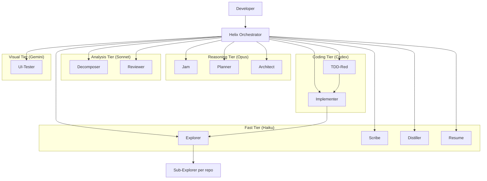

# Helix

Helix is a workspace-first orchestration system for AI-driven development across multiple repos.

This repo currently contains the reusable Helix assets and the working design for how Helix should install into a meta repo. Product code still lives outside Helix.

## What Helix Is For

- Coordinating multi-repo feature delivery
- Running staged AI-assisted workflows from vague idea to reviewed implementation
- Keeping planning, design, task breakdown, and memory outside product repos
- Providing reusable agents, skills, prompts, and context-passing conventions

## What Helix Does Not Own

- Product source code in sibling service repos
- Product deployment infrastructure for those repos
- Raw session transcripts as long-term state

## Human Docs vs Agent Docs

- `README.md` is human-first: overview, workflow, architecture, and entry points
- `AGENTS.md` files are agent-first: navigation, source-of-truth rules, and retrieval guidance
- `docs/` holds longer guides and roadmap material

If you are an agent, start with [`AGENTS.md`](./AGENTS.md), not this file.

## System Architecture



## Lifecycle

Helix runs a staged delivery flow:

```text
SETUP -> JAM -> PRD -> TECH DESIGN -> TASK BREAKDOWN -> IMPLEMENTATION -> REVIEW -> DISTILL
```

The full lifecycle, loops, and artifact rules are defined in [`docs/helix-process.md`](./docs/helix-process.md).

## Execution Modes

| Mode | Mechanism | Use Case |
|------|-----------|----------|
| `interactive` | Handoffs between phase owners | New features, risky work, human-in-the-loop delivery |
| `manual` | Human triggers each task individually | Step-by-step review of every change; no autonomous scheduling |
| `fast-track` | Auto-chain planning phases into Ralph loop | Trusted work where phase outputs are already solid |
| `ralph-loop` | Highest-priority unblocked task, commit, repeat | Default autonomous implementation mode |
| `fleet` | Parallel implementers on disjoint tasks | Independent tasks with locked contracts and non-overlapping ownership |

## Agent Roster

| Agent | Tier | Purpose |
|------|------|---------|
| `setup` | analysis | Owns post-bootstrap setup before Helix orchestration begins |
| `helix` | analysis | Pure dispatcher and phase router |
| `jam` | reasoning | Clarifies intent |
| `planner` | reasoning | Produces PRD |
| `architect` | reasoning | Produces technical design |
| `decomposer` | analysis | Produces task board and execution plan |
| `explorer` | fast | Gathers evidence-backed context |
| `tdd-red` | coding | Writes failing tests |
| `implementer` | coding | Implements tasks through TDD |
| `reviewer` | analysis | Runs multi-lens review |
| `scribe` | fast | Updates task boards and decisions |
| `distiller` | fast | Writes memory and learnings |
| `resume` | fast | Reconstructs session state |
| `ui-tester` | visual | Playwright and UI verification |

## Repository Layout

```text
helix/
├── README.md
├── AGENTS.md
├── .github/      # agent definitions, skills, prompts, global instructions
├── .helix/       # active workspace, model config, memory
├── workspaces/   # workspace-scoped artifacts and bundles
├── docs/         # human-facing guides and roadmap
├── templates/    # artifact templates and examples
├── scripts/      # helper scripts and lifecycle hooks
├── hooks/        # hook configuration
├── decisions/    # legacy placeholder, not canonical workspace state
└── task-boards/  # legacy placeholder, not canonical workspace state
```

## Workspace Model

Workspace-scoped artifacts are the source of truth for feature delivery:

```text
workspaces/{name}/
├── workspace.yml
├── refined-intent.md
├── prd.md or prd/
├── tech-design.md or tech-design/
├── task-boards/
├── execution-plans/
├── decisions/
└── context-bundle-*.md
```

Principles:

- Workspace artifacts stay in Helix
- Product code changes stay in sibling repos
- Execution plans are the machine-readable source of truth for automation
- Context bundles are task-scoped evidence, not general documentation
- If an artifact grows too large, prefer an `index.md` plus annexes or subdocuments over a single blob
- **Beta:** Execution plans support `slices[]` for logical task groupings with verification gates; `execution.mode` supersedes the old `scheduler.default_mode` field. See [`docs/helix-process.md`](./docs/helix-process.md) for the full loop model.

## Target Deployment Model

Helix is moving toward:

- `helix-core` as the reusable source of truth
- a meta repo as the installed coordination instance
- attached product repos selected through `helix-repos.yml`

> **Legacy:** installed meta repos may still carry `repos.yml` as a compatibility alias. New installs should treat `helix-repos.yml` as canonical.

The target packaging and installation model is defined in [`docs/helix-core-meta-repo-model.md`](./docs/helix-core-meta-repo-model.md).
The target meta-repo manifest shapes are defined in [`docs/helix-instance-schemas.md`](./docs/helix-instance-schemas.md).

Current script entry points in this repo:

- `scripts/init.ps1` — wrapper for future `helix init` (delegates to `init-meta-repo.ps1`)
- `scripts/sync.ps1` — wrapper for future `helix sync` (delegates to `sync-helix.ps1`)
- `scripts/upgrade.ps1` — wrapper for future `helix upgrade` (delegates to `sync-helix.ps1`)
- `scripts/workspace-setup.ps1` — wrapper for future `helix workspace setup` (delegates to `setup-workspace.ps1`)
- `scripts/doctor.ps1` — validate manifests, workspace layout, user-level agent collisions, and repo readiness
- `scripts/install-helix.ps1` — install or sync managed Helix files into a meta repo
- `scripts/set-context-provider.ps1` — configure the code-review-graph provider; `off` is an emergency fallback
- `scripts/init-meta-repo.ps1`, `scripts/sync-helix.ps1`, and `scripts/setup-workspace.ps1` — underlying implementation scripts kept for compatibility and internal wiring

## Structural Retrieval

Helix uses `code-review-graph` (CRG) as the default code-centric retrieval layer.

- Keep Helix workspace artifacts as the source of truth for intent, design, and task contracts
- Use CRG as the first stop for code navigation, blast radius, changed-file scoping, flow analysis, and targeted dependency lookup
- Keep the provider in `mcp` mode for normal setup; `off` is an emergency fallback for using default agent/search behavior
- Init seeds a clean `.vscode/mcp.json` for VS Code project config
- Init enables and bootstraps CRG with `scripts/set-context-provider.ps1 -Provider code-review-graph -Mode mcp -Bootstrap`
- That command reconciles both documented host locations without overwriting unrelated servers:
  - `.vscode/mcp.json` for VS Code project-level MCP
  - `~/.copilot/mcp-config.json` for Copilot CLI user-level MCP
- Switching back to `off` removes only the Helix-managed `code-review-graph` entry from those host configs and should be treated as an explicit emergency/debug action

## Optional LSP Support

Copilot CLI LSP support is useful, but Helix should treat it as **advisory context infrastructure**, not mandatory setup.

- LSP reduces token use for symbol navigation, references, rename, and hover by returning compact structured results instead of broad file reads
- LSP does **not** replace CRG: use LSP for language-accurate symbol work, CRG for blast radius, communities, flows, and cross-file review context
- Helix should document and detect LSP, but not auto-install language servers by default because they are language-specific and environment-specific

## Where To Start

- Bootstrap a new meta repo: run `scripts/init.ps1`, then update `helix-repos.yml`, create `workspaces/{name}/workspace.yml`, and use `scripts/workspace-setup.ps1`, the `setup` agent, or the `workspace-sync` skill to attach the selected repos
- New to Helix: [`docs/starting-cross-repo-feature-with-helix.md`](./docs/starting-cross-repo-feature-with-helix.md)
- Canonical lifecycle and loops: [`docs/helix-process.md`](./docs/helix-process.md)
- Copilot session traces and Lens overlay plan: [`docs/trace-schema.md`](./docs/trace-schema.md) and [`docs/copilot-session-overlay-plan.md`](./docs/copilot-session-overlay-plan.md)
- Core vs meta-repo model: [`docs/helix-core-meta-repo-model.md`](./docs/helix-core-meta-repo-model.md)
- Meta-repo manifest schemas: [`docs/helix-instance-schemas.md`](./docs/helix-instance-schemas.md)
- Future platform direction: [`docs/helix-platform-roadmap.md`](./docs/helix-platform-roadmap.md)
- Agent navigation and source-of-truth rules: [`AGENTS.md`](./AGENTS.md)

## Optional Second-Opinion Critique

When Copilot provides an optional second-opinion critique capability, Helix can use it at high-return checkpoints.

- Best checkpoints: after PRD, after design, after task breakdown, after complex implementation, after writing tests, and when stuck
- Treat the critique as advisory
- If it changes scope, design, or task safety, route back to the right phase and update workspace artifacts
- If it is unavailable, continue the normal Helix flow
