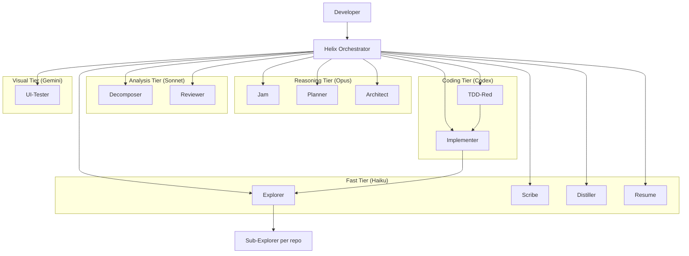

# Helix

Helix is a meta-repo for orchestrating AI-driven development across multiple service repos.

It owns workspace artifacts, agent definitions, memory, prompts, templates, and orchestration guidance. It does **not** own the product code for the services it coordinates.

## What Helix Is For

- Coordinating multi-repo feature delivery
- Running staged AI-assisted workflows from vague idea to reviewed implementation
- Keeping planning, design, task breakdown, and memory outside product repos
- Providing reusable agents, skills, prompts, and context-passing conventions

## What Helix Does Not Own

- Product source code in sibling service repos
- Product deployment infrastructure for those repos
- Raw session transcripts as long-term state

## Human Docs vs Agent Docs

- `README.md` is human-first: overview, workflow, architecture, and entry points
- `AGENTS.md` files are agent-first: navigation, source-of-truth rules, and retrieval guidance
- `docs/` holds longer guides and roadmap material

If you are an agent, start with [`AGENTS.md`](./AGENTS.md), not this file.

## System Architecture



## Lifecycle

```text
SETUP            ALIGN           SPECIFY         DESIGN            BREAK DOWN          EXECUTE               REVIEW            LEARN
┌─────────────┐  ┌────────────┐  ┌────────────┐  ┌──────────────┐  ┌───────────────┐  ┌─────────────────┐  ┌──────────────┐  ┌───────────┐
│ Workspace   │  │ JAM        │  │ PRD        │  │ Tech Design  │  │ Tasks +       │  │ TDD + Scheduler │  │ Multi-lens   │  │ Distill   │
│ Sync        │→ │ Refine     │→ │ Plan       │→ │              │→ │ Exec Plan     │→ │ Ralph / Fleet   │→ │ QA Gate      │→ │ Memory    │
│ + Onboard   │  │ Intent     │  │            │  │              │  │               │  │                 │  │              │  │           │
└─────────────┘  └────────────┘  └────────────┘  └──────────────┘  └───────────────┘  └─────────────────┘  └──────────────┘  └───────────┘
```

Key loops:

- `SETUP` loop: sync repos, onboard or refresh context, verify active workspace
- `JAM` loop: clarify intent, inspect code when needed, tighten scope
- `PRD` loop: gather evidence, draft requirements, resolve gaps
- `TECH DESIGN` loop: inspect patterns, lock contracts, revise design
- `TASK BREAKDOWN` loop: split tasks, add ownership and commands, check autonomy safety
- `IMPLEMENTATION` loops:
  - `RED -> GREEN -> REFACTOR -> FULL SUITE`
  - Ralph loop: pick next safe task, execute, record result, repeat
  - Fleet loop: select disjoint tasks, run parallel wave, collect results, repeat
- `REVIEW` loop: security, correctness, domain logic, coding style, test coverage

## Execution Modes

| Mode | Mechanism | Use Case |
|------|-----------|----------|
| `interactive` | Handoffs between phase owners | New features, risky work, human-in-the-loop delivery |
| `fast-track` | Auto-chain planning phases into Ralph loop | Trusted work where phase outputs are already solid |
| `ralph-loop` | Highest-priority unblocked task, commit, repeat | Default autonomous implementation mode |
| `fleet` | Parallel implementers on disjoint tasks | Independent tasks with locked contracts and non-overlapping ownership |

## Agent Roster

| Agent | Tier | Purpose |
|------|------|---------|
| `helix` | analysis | Pure dispatcher and phase router |
| `jam` | reasoning | Clarifies intent |
| `planner` | reasoning | Produces PRD |
| `architect` | reasoning | Produces technical design |
| `decomposer` | analysis | Produces task board and execution plan |
| `explorer` | fast | Gathers evidence-backed context |
| `tdd-red` | coding | Writes failing tests |
| `implementer` | coding | Implements tasks through TDD |
| `reviewer` | analysis | Runs multi-lens review |
| `scribe` | fast | Updates task boards and decisions |
| `distiller` | fast | Writes memory and learnings |
| `resume` | fast | Reconstructs session state |
| `ui-tester` | visual | Playwright and UI verification |

## Repository Layout

```text
helix/
├── README.md
├── AGENTS.md
├── .github/      # agent definitions, skills, prompts, global instructions
├── .helix/       # active workspace, model config, memory
├── workspaces/   # workspace-scoped artifacts and bundles
├── docs/         # human-facing guides and roadmap
├── templates/    # artifact templates and examples
├── scripts/      # helper scripts and lifecycle hooks
├── hooks/        # hook configuration
├── decisions/    # legacy placeholder, not canonical workspace state
└── task-boards/  # legacy placeholder, not canonical workspace state
```

## Workspace Model

Workspace-scoped artifacts are the source of truth for feature delivery:

```text
workspaces/{name}/
├── workspace.yaml
├── refined-intent.md
├── prd.md or prd/
├── tech-design.md or tech-design/
├── task-boards/
├── execution-plans/
├── decisions/
└── context-bundle-*.md
```

Principles:

- Workspace artifacts stay in Helix
- Product code changes stay in sibling repos
- Execution plans are the machine-readable source of truth for automation
- Context bundles are task-scoped evidence, not general documentation
- If an artifact grows too large, prefer an `index.md` plus annexes or subdocuments over a single blob

## Where To Start

- New to Helix: [`docs/starting-cross-repo-feature-with-helix.md`](./docs/starting-cross-repo-feature-with-helix.md)
- Future platform direction: [`docs/helix-platform-roadmap.md`](./docs/helix-platform-roadmap.md)
- Agent navigation and source-of-truth rules: [`AGENTS.md`](./AGENTS.md)

## Optional Copilot Rubber Duck

When running inside GitHub Copilot CLI experimental mode, Helix can use Rubber Duck as an optional second opinion at high-return checkpoints.

- Best checkpoints: after PRD, after design, after task breakdown, after complex implementation, after writing tests, and when stuck
- Treat the critique as advisory
- If it changes scope, design, or task safety, route back to the right phase and update workspace artifacts
- If it is unavailable, continue the normal Helix flow
