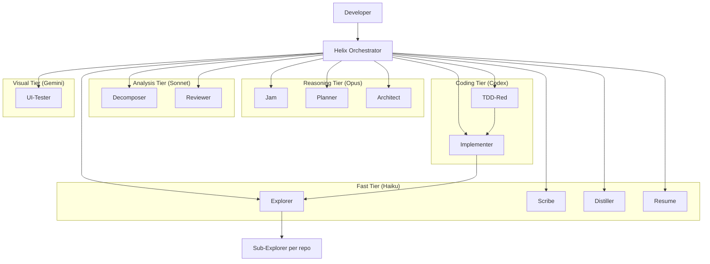

# Helix

Helix is a workspace-first orchestration system for AI-driven development across multiple repos. It installs into a project-specific meta repo that sits alongside product repos and coordinates the work from fuzzy intent through PRD, tech design, task breakdown, implementation, review, and distillation.

This README is the reusable Helix guide. It is meant to make sense in both places Helix appears:

- in the Helix source checkout, where you maintain the reusable assets under this `helix/` directory
- in an installed meta repo, where this guide lives at `helix/README.md` and the meta-repo-local root README explains the project-specific setup

The installed meta repo root `README.md` is generated from `helix/templates/meta-repo.README.md.template`. Keep source-maintainer details here and meta-repo-local operator notes in that template or outside the managed HELIX section in the installed root README.

## What Helix Is For

- Coordinating multi-repo feature delivery
- Running staged AI-assisted workflows from vague idea to reviewed implementation
- Keeping planning, design, task breakdown, and memory outside product repos
- Providing reusable agents, skills, prompts, and context-passing conventions

## What Helix Does Not Own

- Product source code in sibling service repos
- Product deployment infrastructure for those repos
- Raw session transcripts as long-term state

## Human Docs vs Agent Docs

- `helix/README.md` is human-first: overview, workflow, architecture, and entry points
- installed meta repo root `README.md` is project-local: repo registry, workspace setup, and local notes
- `AGENTS.md` files are agent-first: navigation, source-of-truth rules, and retrieval guidance
- `docs/` holds longer guides and roadmap material
- `docs/agents-md-authoring.md` defines the compact root-vs-nested AGENTS.md contract

If you are an agent, start with [`AGENTS.md`](./AGENTS.md), not this file.

## System Architecture



## Lifecycle

Helix runs a staged delivery flow:

```text
SETUP -> JAM -> PRD -> TECH DESIGN -> TASK BREAKDOWN -> IMPLEMENTATION -> REVIEW -> DISTILL
```

The full lifecycle, loops, and artifact rules are defined in [`docs/helix-process.md`](./docs/helix-process.md).

## Execution Modes

| Mode | Mechanism | Use Case |
|------|-----------|----------|
| `interactive` | Handoffs between phase owners | New features, risky work, human-in-the-loop delivery |
| `manual` | Human triggers each task individually | Step-by-step review of every change; no autonomous scheduling |
| `fast-track` | Auto-chain planning phases into Ralph loop | Trusted work where phase outputs are already solid |
| `ralph-loop` | Highest-priority unblocked task, commit, repeat | Default autonomous implementation mode |
| `fleet` | Parallel implementers on disjoint tasks | Independent tasks with locked contracts and non-overlapping ownership |

## Agent Roster

| Agent | Tier | Purpose |
|------|------|---------|
| `setup` | analysis | Owns post-bootstrap setup before Helix orchestration begins |
| `helix` | analysis | Pure dispatcher and phase router |
| `jam` | reasoning | Clarifies intent |
| `planner` | reasoning | Produces PRD |
| `architect` | reasoning | Produces technical design |
| `decomposer` | analysis | Produces task board and execution plan |
| `explorer` | fast | Gathers evidence-backed context |
| `tdd-red` | coding | Writes failing tests |
| `implementer` | coding | Implements tasks through TDD |
| `reviewer` | analysis | Runs multi-lens review |
| `scribe` | fast | Updates task boards and decisions |
| `distiller` | fast | Writes memory and learnings |
| `resume` | fast | Reconstructs session state |
| `ui-tester` | visual | Playwright and UI verification |

## Repository Layout

```text
helix/
├── README.md
├── AGENTS.md
├── .github/      # agent definitions, skills, prompts, hooks
├── .helix/       # active workspace, model config, memory
├── workspaces/   # workspace-scoped artifacts and bundles
├── docs/         # human-facing guides and roadmap
├── templates/    # artifact templates and examples
├── scripts/      # helper scripts and lifecycle hooks
├── hooks/        # hook configuration
├── decisions/    # legacy placeholder, not canonical workspace state
└── task-boards/  # legacy placeholder, not canonical workspace state
```

## Workspace Model

Workspace-scoped artifacts are the source of truth for feature delivery:

```text
workspaces/{name}/
├── workspace.yml
├── refined-intent.md
├── prd.md or prd/
├── tech-design.md or tech-design/
├── task-boards/
├── execution-plans/
├── decisions/
└── context-bundle-*.md
```

Principles:

- Workspace artifacts stay in Helix
- Product code changes stay in sibling repos
- Execution plans are the machine-readable source of truth for automation
- Context bundles are task-scoped evidence, not general documentation
- If an artifact grows too large, prefer an `index.md` plus annexes or subdocuments over a single blob
- **Beta:** Execution plans support `slices[]` for logical task groupings with verification gates; `execution.mode` supersedes the old `scheduler.default_mode` field. See [`docs/helix-process.md`](./docs/helix-process.md) for the full loop model.

## Target Deployment Model

Helix is moving toward:

- `helix-core` as the reusable source of truth
- a meta repo as the installed coordination instance
- attached product repos selected through `helix-repos.yml`

> **Legacy:** installed meta repos may still carry `repos.yml` as a compatibility alias. New installs should treat `helix-repos.yml` as canonical.

The target packaging and installation model is defined in [`docs/helix-core-meta-repo-model.md`](./docs/helix-core-meta-repo-model.md).
The target meta-repo manifest shapes are defined in [`docs/helix-instance-schemas.md`](./docs/helix-instance-schemas.md).

## Meta Repo Setup From Scratch

Run the bootstrap command from the Helix source checkout, not from the empty target repo. If you are at the repository root that contains `helix/`, use `.\helix\scripts\init-meta-repo.ps1`; if you are already inside the `helix/` directory, use:

```powershell
.\scripts\init-meta-repo.ps1 -TargetRoot C:\path\to\my-meta-repo
```

Then switch to the target meta-repo root:

```powershell
Set-Location C:\path\to\my-meta-repo
```

Edit `helix-repos.yml` so every repo has a real `id`, `remote`, `local_path`, default branch, and optional `default_role`.

For a first workspace, seed `workspaces/{workspace}/workspace.yml` from the repo ids you want active:

```powershell
.\helix\scripts\workspace-setup.ps1 -Workspace directeddebit -ReposCsv "orders-api,orders-web,customer-profile-adapter" -CloneMissing
```

If the workspace manifest already exists, edit `workspaces/{workspace}/workspace.yml` directly and rerun:

```powershell
.\helix\scripts\workspace-setup.ps1 -Workspace directeddebit -FetchExisting
```

Validate the installed meta repo:

```powershell
.\helix\scripts\doctor.ps1
```

Setup is ready when `.helix/active-workspace.yml` points at the workspace, `.helix/repo-state/*.yml` and `.helix/repo-capabilities/*.yml` exist for participating repos, `{workspace}.code-workspace` exists at the meta-repo root, and the participating repos have root `AGENTS.md` guidance.

Open `{workspace}.code-workspace` in VS Code when working through the editor. In Copilot CLI, start from the meta-repo root so Helix can read `.helix/active-workspace.yml` and the workspace artifacts.

## Common Setup Scenarios

| Scenario | What to do |
|----------|------------|
| New meta repo | Run `scripts/init-meta-repo.ps1` from the Helix source checkout, then update `helix-repos.yml` in the target repo |
| First workspace from known repo ids | Run `.\helix\scripts\workspace-setup.ps1 -Workspace <id> -ReposCsv "repo-a,repo-b" -CloneMissing` |
| Workspace manifest already exists | Edit `workspaces/<id>/workspace.yml`, then run `.\helix\scripts\workspace-setup.ps1 -Workspace <id> -FetchExisting` |
| Add another repo to a workspace | Add it to `helix-repos.yml`, add its `repo_id` to `workspaces/<id>/workspace.yml`, then rerun workspace setup |
| Switch active workspace | Run `.\helix\scripts\workspace-setup.ps1 -Workspace <other-id> -FetchExisting`; this rewrites `.helix/active-workspace.yml` |
| Refresh after onboarding or branch changes | Rerun `.\helix\scripts\workspace-setup.ps1 -Workspace <id> -FetchExisting` to refresh repo state, capability hints, AGENTS.md readiness, and CRG graphs |
| CRG bootstrap or repair | Run `.\helix\scripts\set-context-provider.ps1 -Provider code-review-graph -Mode mcp -Bootstrap`, then rerun workspace setup |
| CRG is blocking urgent work | Set `.\helix\scripts\set-context-provider.ps1 -Provider code-review-graph -Mode off` as an explicit emergency fallback |
| Sync installed Helix files from source | Run `.\helix\scripts\sync-helix.ps1` from the meta-repo root |
| Validate current install | Run `.\helix\scripts\doctor.ps1` |

## Script Reference

| Script | Run from | Use |
|--------|----------|-----|
| `.\scripts\init-meta-repo.ps1` or `.\helix\scripts\init-meta-repo.ps1` | Helix source checkout | Bootstrap a target meta repo |
| `.\scripts\init.ps1` or `.\helix\scripts\init.ps1` | Helix source checkout | Wrapper for future `helix init` |
| `.\helix\scripts\install-helix.ps1` | Installed meta repo or source checkout | Install or sync managed Helix files into a meta repo |
| `.\helix\scripts\sync-helix.ps1` | Installed meta repo | Sync managed files from the recorded Helix source path |
| `.\helix\scripts\sync.ps1` | Installed meta repo | Wrapper for future `helix sync` |
| `.\helix\scripts\upgrade.ps1` | Installed meta repo | Wrapper for future `helix upgrade` |
| `.\helix\scripts\workspace-setup.ps1` | Installed meta repo | Operator-facing workspace setup wrapper |
| `.\helix\scripts\setup-workspace.ps1` | Installed meta repo | Canonical workspace setup implementation |
| `.\helix\scripts\doctor.ps1` | Installed meta repo | Validate manifests, workspace layout, agent collisions, CRG config, and repo readiness |
| `.\helix\scripts\set-context-provider.ps1` | Installed meta repo | Configure `code-review-graph`; `off` is an emergency fallback |

## When To Start Agents

Use the `setup` agent only after Helix has been bootstrapped into the meta repo. It is for validating registry/workspace manifests, running `.\helix\scripts\workspace-setup.ps1`, onboarding repos, refreshing repo-state, and reporting readiness. If the workspace manifest is missing, include repo ids in the prompt so the agent can pass `-ReposCsv`; otherwise create or edit `workspaces/<workspace-id>/workspace.yml` first.

Start the `helix` agent after SETUP is complete. That means the active workspace is set, selected repos are present or explicitly marked missing, generated state files exist, and CRG is either healthy in `mcp` mode or deliberately disabled for emergency fallback.

Good first prompts:

```text
@setup Set up workspace directeddebit, clone missing repos, refresh repo-state, and report readiness.
```

If `workspaces/directeddebit/workspace.yml` does not exist yet:

```text
@setup Set up workspace directeddebit with repos repo-a, repo-b, repo-c. Clone missing repos, refresh repo-state, and report readiness.
```

```text
@helix Use active workspace directeddebit. Start JAM for: <feature idea>. Keep mode interactive.
```

After PRD, tech design, and task breakdown produce a runnable execution plan, use `@helix` for the Ralph loop:

```text
@helix Start Ralph loop for directeddebit using the current execution plan.
```

For Copilot CLI, interactive phases such as JAM, PRD, and tech design can be invoked directly as `@jam`, `@planner`, or `@architect` when you need structured back-and-forth. Use `@helix` when you want routing, phase chaining, resume decisions, or autonomous implementation orchestration.

## Structural Retrieval

Helix uses `code-review-graph` (CRG) as the default code-centric retrieval layer.

- Keep Helix workspace artifacts as the source of truth for intent, design, and task contracts
- Use CRG as the first stop for code navigation, blast radius, changed-file scoping, flow analysis, and targeted dependency lookup
- Keep the provider in `mcp` mode for normal setup; `off` is an emergency fallback for using default agent/search behavior
- Init seeds a clean `.vscode/mcp.json` for VS Code project config
- Init enables and bootstraps CRG with `scripts/set-context-provider.ps1 -Provider code-review-graph -Mode mcp -Bootstrap`
- That command reconciles both documented host locations without overwriting unrelated servers:
  - `.vscode/mcp.json` for VS Code project-level MCP
  - `~/.copilot/mcp-config.json` for Copilot CLI user-level MCP
- Switching back to `off` removes only the Helix-managed `code-review-graph` entry from those host configs and should be treated as an explicit emergency/debug action

## Optional LSP Support

Copilot CLI LSP support is useful, but Helix should treat it as **advisory context infrastructure**, not mandatory setup.

- LSP reduces token use for symbol navigation, references, rename, and hover by returning compact structured results instead of broad file reads
- LSP does **not** replace CRG: use LSP for language-accurate symbol work, CRG for blast radius, communities, flows, and cross-file review context
- Helix should document and detect LSP, but not auto-install language servers by default because they are language-specific and environment-specific

## Where To Start

- Installed meta repo operator: start with the root `README.md`, then use this guide for deeper Helix behavior
- Helix source maintainer: start with the source root `README.md`, then [`AGENTS.md`](./AGENTS.md)
- Fresh meta-repo setup: use [Meta Repo Setup From Scratch](#meta-repo-setup-from-scratch)
- Common setup and repair cases: use [Common Setup Scenarios](#common-setup-scenarios)
- Script lookup: use [Script Reference](#script-reference)
- Feature workflow handoff: use [When To Start Agents](#when-to-start-agents)
- New to Helix: [`docs/starting-cross-repo-feature-with-helix.md`](./docs/starting-cross-repo-feature-with-helix.md)
- Canonical lifecycle and loops: [`docs/helix-process.md`](./docs/helix-process.md)
- Copilot session traces, hooks, environment, and Lens overlay plan: [`docs/trace-schema.md`](./docs/trace-schema.md), [`docs/copilot-cli-hooks-and-env.md`](./docs/copilot-cli-hooks-and-env.md), and [`docs/copilot-session-overlay-plan.md`](./docs/copilot-session-overlay-plan.md)
- Core vs meta-repo model: [`docs/helix-core-meta-repo-model.md`](./docs/helix-core-meta-repo-model.md)
- Meta-repo manifest schemas: [`docs/helix-instance-schemas.md`](./docs/helix-instance-schemas.md)
- AGENTS.md authoring standard: [`docs/agents-md-authoring.md`](./docs/agents-md-authoring.md)
- Meta-repo skills management: [`docs/meta-repo-skills-management.md`](./docs/meta-repo-skills-management.md)
- HC/HR runtime surface rename plan: [`docs/hc-hr-runtime-surface-rename-plan.md`](./docs/hc-hr-runtime-surface-rename-plan.md)
- Future platform direction: [`docs/helix-platform-roadmap.md`](./docs/helix-platform-roadmap.md)
- Agent navigation and source-of-truth rules: [`AGENTS.md`](./AGENTS.md)

## Optional Second-Opinion Critique

When Copilot provides an optional second-opinion critique capability, Helix can use it at high-return checkpoints.

- Best checkpoints: after PRD, after design, after task breakdown, after complex implementation, after writing tests, and when stuck
- Treat the critique as advisory
- If it changes scope, design, or task safety, route back to the right phase and update workspace artifacts
- If it is unavailable, continue the normal Helix flow
